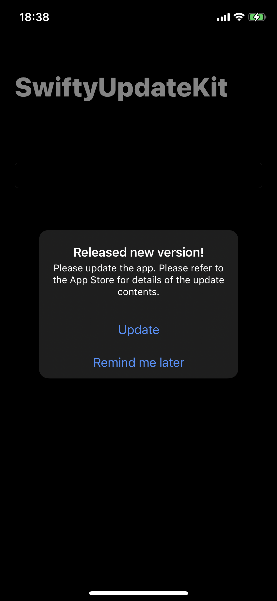
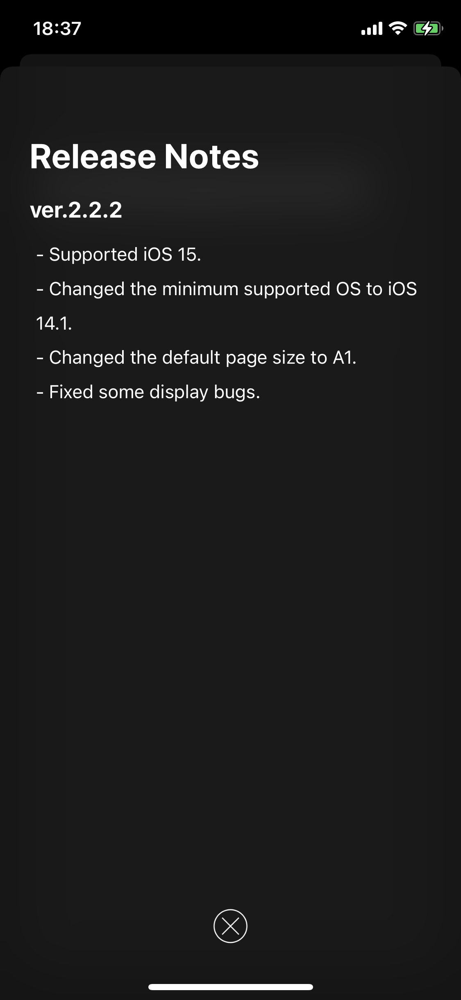
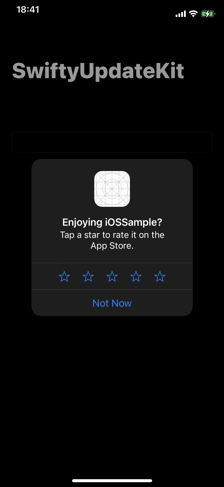

# SwiftyUpdateKit

[](https://github.com/HituziANDO/SwiftyUpdateKit/actions/workflows/ci.yml)


SwiftyUpdateKit is a framework for iOS and macOS. This framework supports for a user to update your app when new app version is released on the App Store.

## Supports

|OS|version|
|:-:|:-:|
|iOS|13.0+|
|macOS|10.15+|

## Requires

- Swift 5+

## Installation

### Carthage (recommended)

SwiftyUpdateKit is available through [Carthage](https://github.com/Carthage/Carthage). To install it, simply add the following line to your Cartfile:

```
github "HituziANDO/SwiftyUpdateKit"
```

### CocoaPods

SwiftyUpdateKit is available through [CocoaPods](http://cocoapods.org). To install it, simply add the following line to your Podfile:
	
```ruby
pod "SwiftyUpdateKit"
```

## Usage

### Import Framework

```swift
import SwiftyUpdateKit
```

### Initialize

To initialize this framework, you use `SUK.applicationDidFinishLaunching` method in `application(_:,didFinishLaunchingWithOptions:)` method (macOS: `applicationDidFinishLaunching(_:)` method) of AppDelegate. See following:

```swift
let config = SwiftyUpdateKitConfig(
    // Current app version.
    version: Bundle.main.infoDictionary!["CFBundleShortVersionString"] as! String,
    // iTunes ID.
    // e.g.) The App Store URL: "https://apps.apple.com/app/sampleapp/id1234567890" -> iTunesID is 1234567890
    iTunesID: "1234567890",
    // The App Store URL of your app.
    storeURL: "https://apps.apple.com/app/your-app/id1234567890",
    // The country code used by iTunes Search API.
    // See http://en.wikipedia.org/wiki/ISO_3166-1_alpha-2 for a list of ISO Country Codes.
    country: "us",
    // The method to compare the app version.
    versionCompare: VersionCompare(),
    // The update alert's title.
    updateAlertTitle: "Released new version!",
    // The update alert's message.
    updateAlertMessage: "Please update the app. Please refer to the App Store for details of the update contents.",
    // The update button's label.
    updateButtonTitle: "Update",
    // The remind-me-later button's label. If nil is specified, the button is hidden.
    // That is, you can force a user to update because it cannot be canceled.
    remindMeLaterButtonTitle: "Remind me later"
)
SUK.applicationDidFinishLaunching(withConfig: config)
```

### Quick Usage

To check whether new version is released, you use `SUK.checkVersion` method in `viewDidAppear` method of the view controller. See following:

```swift
SUK.checkVersion(VersionCheckConditionAlways(), newRelease: { [weak self] newVersion, releaseNotes, firstUpdated in
    guard let self = self else { return }
    SUK.showReleaseNotes(from: self, text: releaseNotes, version: newVersion)
}) {
    SUK.requestReview(RequestReviewConditionAlways())
}
```

First, this code shows the update alert if current app version is old.



Next, when new app version is installed, it shows the release notes of your app's the App Store page.



Finally, if the app version is latest and the release notes have already shown, it requests the review about your app.



### Use custom UI

You can use custom UI to show the update alert and the release notes. See following:

```swift
SUK.checkVersion(VersionCheckConditionAlways(), update: { [weak self] newVersion, releaseNotes in
    guard let self = self else { return }
    // This closure is called when current app version is old.
    // Show custom update alert: present your view controller or add your view for the update alert.
}, newRelease: { [weak self] newVersion, releaseNotes, firstUpdated in
    guard let self = self else { return }
    // Show custom release notes: present your view controller or add your view to show the release notes.
}) {
    // noop
}
```

To show custom update alert, the view controller presents your view controller or adds your view for the update alert in `update` closure. To open the App Store page of your app, you use following method:

```swift
SUK.openAppStore()
```

### Reset the status

Resets the status: stored date of version check condition, stored date of request review condition, and stored app version for the release notes.

For example, you may use `SUK.reset` method during testing and development.

```swift
SUK.reset()
```

## Version Comparison Method

Default version comparison method refers to [here](https://github.com/HituziANDO/SwiftyUpdateKit/blob/main/Framework/Sources/VersionCompare.swift#L26). If you need another comparison method, you implement the `VersionComparable` protocol and set it to `versionCompare` argument in the SwiftyUpdateKitConfig.

## API Reference

To make the document of this framework, you run following command on the Terminal. This script depends on [jazzy](https://github.com/realm/jazzy).

```
./make_docs.sh
```
